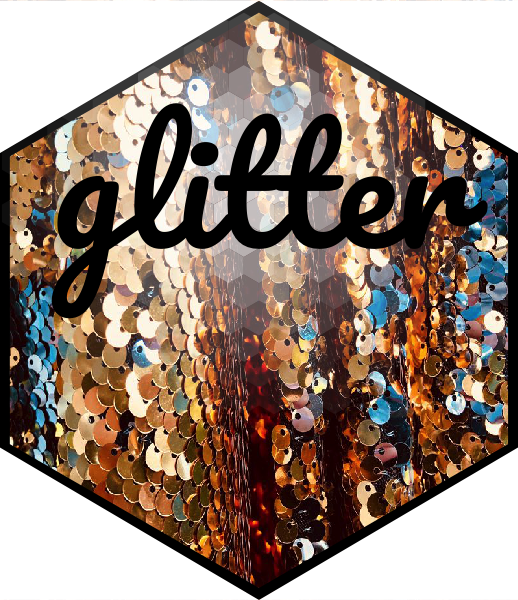

# glitter   

This package contains convenience functions to
perform basic Git commands such as add, commit, and push directly from
the R console. A file recovery feature enables easy retrieval of a previously 
deleted file directly from the R console. For package deployment, helper functions 
allow for a concurrent deployment of both a new package release to a GitHub 
repository and an updated pkgdown GitHub Page.  
    

## Installation  

```
library(devtools)  
install_github("meerapatelmd/glitter")  
```  


## Code of Conduct  

Please note that the glitter project is released with a [Contributor Code of Conduct](https://contributor-covenant.org/version/2/0/CODE_OF_CONDUCT.html). By 
contributing to this project, you agree to abide by its terms. 


